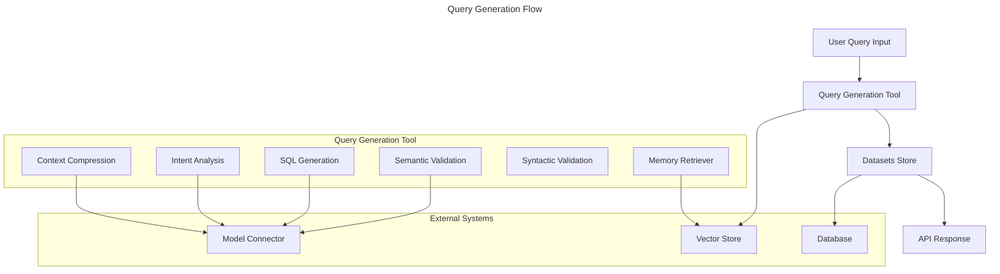

# LLM Chat Component

A Loopack4 based component to integrate a basic Langgraph.js based endpoint in your application which can use any tool that you register using the provided decorator.

### Installation

Install AIIntegrationsComponent using `npm`;

```sh
$ [npm install | yarn add] lb4-llm-chat-component
```

### Basic Usage

Configure and load the AIIntegrations component in the application constructor
as shown below.

```ts
import {AiIntegrationsComponent} from 'lb4-llm-chat-component';
// ...
export class MyApplication extends BootMixin(
  ServiceMixin(RepositoryMixin(RestApplication)),
) {
  constructor(options: ApplicationConfig = {}) {
    // could be any LLM provider or your own LangGraph supported LLM provider
    // you can also have different LLM for different LLM type - cheap, smart and multimodal
    this.bind(AiIntegrationBindings.CheapLLM).toProvider(Ollama);
    this.bind(AiIntegrationBindings.SmartLLM).toProvider(Ollama);
    this.bind(AiIntegrationBindings.FileLLM).toProvider(Ollama);
    // configuration
    this.bind(AiIntegrationBindings.Config).to({
      // if not set to true, it will bind a ARC based sequence from @sourceloop/core with authentication and authorization
      useCustomSequence: true,
      // if not set to false, it will bind the core component from @sourceloop/core by default
      mountCore: false
      // if not set to false, it will bind @sourceloop/file-utils component with defaults config
      mountFileUtils: false
    });
    this.component(AiIntegrationsComponent);

    // ...
  }
  // ...
}
```

## LLM Providers

### Ollama

To need the `Ollama` based models, install the package - `@langchain/ollama` and update your application.ts -

```ts
this.bind(AiIntegrationBindings.CheapLLM).toProvider(Ollama);
this.bind(AiIntegrationBindings.SmartLLM).toProvider(Ollama);
this.bind(AiIntegrationBindings.FileLLM).toProvider(Ollama);
```

### Gemini

To use the `Gemini` based models, install the package - `@google/generative-ai` and `@langchain/google-genai` and update your application.ts -

```ts
this.bind(AiIntegrationBindings.CheapLLM).toProvider(Gemini);
this.bind(AiIntegrationBindings.SmartLLM).toProvider(Gemini);
this.bind(AiIntegrationBindings.FileLLM).toProvider(Gemini);
```

### Cerebras

To use the `Cerebras` based models, install the package - `@langchain/cerebras` and update your application.ts -

```ts
this.bind(AiIntegrationBindings.CheapLLM).toProvider(Cerebras);
this.bind(AiIntegrationBindings.SmartLLM).toProvider(Cerebras);
this.bind(AiIntegrationBindings.FileLLM).toProvider(Cerebras);
```

### Anthropic

To use the `Anthropic` based models, install the package - `@langchain/anthropic` and update your application.ts -

```ts
this.bind(AiIntegrationBindings.CheapLLM).toProvider(Anthropic);
this.bind(AiIntegrationBindings.SmartLLM).toProvider(Anthropic);
this.bind(AiIntegrationBindings.FileLLM).toProvider(Anthropic);
```

### OpenAI

To use the `OpenAI` models, install the package - `@langchain/openai` and update your application.ts -

```ts
this.bind(AiIntegrationBindings.CheapLLM).toProvider(OpenAI);
this.bind(AiIntegrationBindings.SmartLLM).toProvider(OpenAI);
this.bind(AiIntegrationBindings.FileLLM).toProvider(OpenAI);
```

### Bedrock

To use the `Bedrock` based models, install the package - `@langchain/aws` and update your application.ts -

```ts
this.bind(AiIntegrationBindings.CheapLLM).toProvider(Bedrock);
this.bind(AiIntegrationBindings.SmartLLM).toProvider(Bedrock);
this.bind(AiIntegrationBindings.FileLLM).toProvider(Bedrock);
```

This binding would add an endpoint `/generate` in your service, that can answer user's query using the registered tools. By default, the module gives one set of tools through the `DbQueryComponent`

## Limiters

The package provides a way to limit the usage of the LLM Chat functionality by binding a provider on the key `AiIntegrationBindings.LimitStrategy` that follows the interface - `ILimitStrategy`.

The packages comes with 3 strategies by default that are bound automatically on the basis of `AiIntegrationBindings.Config` -

- **ChatCountStrategy** - Applies limits per user based on number of chats. It is used if only `chatLimit` and `period` is provided in `tokenCounterConfig`.
- **TokenCountStrategy** - Applies a fixed limit per user based on number of tokens used. It is used if `tokenLimit` and `period` are provided with `bufferToken` as optional field that determines that how much buffer to keep while checking for token limit.
- **TokenCountPerUserStrategy** - Applies token based limit similar to `TokenCountStrategy` except the number of tokens commes from user permission `TokenUsage:NUMBER` in the user's token. It applies if only `period` is set in `tokenCounterConfig`, it also works with `bufferToken` just like `TokenCountStrategy`.

## DbQueryComponent

This component provides a set of pre-built tools that can be plugged into any Loopback4 application -

- **generate-query** - this tool can be used by the LLM to generate a database query based on user's prompt. It will return a `DataSet` instead of the query directly to the LLM.
- **improve-query** - this tool takes a `DataSet`'s id and feedback from the user, and uses it to modify the existing `DataSet` query. Users can also vote on datasets via the dataset actions endpoint.
- **ask-about-dataset** - this tool takes a `DataSet`'s id and a user prompt, and tries to answer user's question about the database query. Note that it can not run the query.

### Database Schema

The component uses a dedicated `chatbot` schema with the following tables:

- **datasets** - Stores generated SQL queries with metadata including description, prompt, tables involved, and schema hash
- **dataset_actions** - Tracks user actions on datasets (votes, comments, improvements)
- **chats** - Stores chat sessions with metadata and token usage
- **messages** - Stores individual messages within chats

### Dataset Feedback System

Users can provide feedback on generated datasets through the dataset actions endpoint. Each dataset can receive votes and comments, which can be used to improve future query generation. The system tracks:

- Vote count for each dataset
- User comments and suggestions
- Improvement history
- Creation and modification timestamps

### Query Generation Flow



## Providing Context

There are two ways to provide context to the LLM -

### Global Context

Global context can be provided as an array of strings through a binding on key `DbQueryAIExtensionBindings.GlobalContext`. This binding can be a constant or come through a dynamic provider, something like this -

```ts
export class ChecksProvider implements Provider<string[]> {
  constructor(
    @repository(CurrencyRepository)
    private readonly currencyRepository: CurrencyRepository,
  ) {}
  async value(): Promise<string[]> {
    return [`Current date is ${new Date().toISOString().split('T')[0]}`];
  }
}
```

in application.ts -

```ts
...
this.bind(DbQueryAIExtensionBindings.GlobalContext).toProvider(ChecksProvider);
...
```

### Model Context

Each model can have associated context in 3 ways -

```ts
@model({
  name: 'employees', // Use plural form for table name
  settings: {
    description: 'Model representing an employee in the system.',
    context: [
      'employee salary must be converted to USD, using the currency_id column and the exchange rate table',
    ],
  },
})
export class Employee extends Entity {
  ...
  @property({
    type: 'string',
    required: true,
    description: 'Name of the employee',
  })
  name: string;

  @property({
    type: 'string',
    required: true,
    description: 'Unique code for the employee, used for identification',
  })
  code: string;

  @property({
    type: 'number',
    required: true,
    description:
      'The salary of the employee in the currency stored in currency_id column',
  })
  salary: number;
  ...
}
```

- Model description - this is the primary description of the model, it is used to select model for generation, so it should only define the purpose of the model itself.
- Model context - this is secondary information about the model, usually defining some specific details about the model that must be kept in mind while using it. NOTE - These values should always include the model name. This must be information that is applicable to overall model usage, or atleast to multiple columns, and not related to any single field of the model.
- Property description - this is the description for a property of a model, providing context for the LLM on how to use and understand a particular property.

## Usage

You just need to register your models in the configuration of the component, and if the Models have proper and detailed descriptions, the tools should be able to answer the user's prompts based on those descriptions.

```ts
this.bind(DbQueryAIExtensionBindings.Config).to({
  models: [
    {
      model: Employee, // A normal loopback4 model class with proper description
      readPermissionKey: '1', // permission key used to check access for this particular model/table
    },
  ],
  db: {
    dialect: SupportedDBs.PostgreSQL, // dialect for which the SQL will be generated.
    schema: 'public', // schema of the database in case of DBs like Postgresql
    ignoredColumns: ['deleted'], // list of db column names that will be ignored for query generation (Do not use Loopback field names in this list)
  },
  readAccessForAI: false // give access of the query result to the llm
  maxRowsForAI: 0 // number of rows from the result that are passed to the LLM
  columnSelection: false // add a column selection step in generation in case you have tables with a lot of columns.
});
```

## Connectors

The package comes with 3 connectors by default -

- **PgConnector** - basic connector for PostgreSQL databases
- **SqlLiteConnector** - basic connector SqlLite databases, can be used for testing
- **PgWithRlsConnector** - Connector for PostgreSQL databases with support for [Row Security Policies](https://www.postgresql.org/docs/current/ddl-rowsecurity.html). Refer [`PgWithRlsConnector`](#pgwithrlsconnector) for more details.

You can write your own connector by following the `IDbConnector` interface and and binding it on `DbQueryAIExtensionBindings.Connector`.

By default, the package binds `PgWithRlsConnector` but if you are not planning to use row security policies or default conditions, you can bind `PgConnector` -

```ts
// application.ts
this.bind(DbQueryAIExtensionBindings.Connector).toClass(PgConnector);
```

## Default Conditions

The package allows binding an optional provider on key `DbQueryAIExtensionBindings.DefaultConditions` that are applied on every query generated by the LLM. **NOTE** This only works for connectors that support this option.

As of now, the only provider that supports this is `PgWithRlsConnector`.

## PgWithRlsConnector

You can take advantage of the `DbQueryAIExtensionBindings.DefaultConditions` by using this connector with a PostgreSQL database. To use this you need to first setup your database to use [Row Security Policies](https://www.postgresql.org/docs/current/ddl-rowsecurity.html). You can use an SQL script that looks something like this to do this -

```sql
DO $$
DECLARE
    tbl text;
    tables text[] := ARRAY[
        'main.test-table',
    ];
BEGIN
    FOREACH tbl IN ARRAY tables LOOP
        -- Enable RLS
        EXECUTE format('ALTER TABLE %I ENABLE ROW LEVEL SECURITY;', tbl);

        -- Drop existing policy if it already exists (to avoid duplicates)
        EXECUTE format('DROP POLICY IF EXISTS tenant_policy ON %I;', tbl);

        -- Create policy (applies to SELECT, INSERT, UPDATE, DELETE)
        EXECUTE format($f$
            CREATE POLICY tenant_policy ON %I
            -- conditions to apply by default are tenant id = some value and deleted = false
            USING (tenant_id = current_setting('app.current_tenant')::int AND deleted = false)
            WITH CHECK (false);
        $f$, tbl);
    END LOOP;
END$$;
```

Once the policies are setup, you can bind the provider for `DbQueryAIExtensionBindings.DefaultConditions` -

```ts
// default-conditions.provider.ts
import {IAuthUserWithPermissions} from '@sourceloop/core';
import {AuthenticationBindings} from 'loopback4-authentication';
import {AnyObject} from '@loopback/repository';
import {Provider} from '@loopback/core';

class DefaultConditionsProvider implements Provider<AnyObject> {
  constructor(
    @inject(AuthenticationBindings.CURRENT_USER)
    private readonly user: IAuthUserWithPermissions,
  ) {}
  value() {
    return {
      tenant_id: this.user.tenantId,
    };
  }
}
```

```ts
// application.ts
this.bind(DbQueryAIExtensionBindings.DefaultConditions).to(
  DefaultConditionsProvider,
);
```

## Writing Your Own Tool

You can register your own tools by simply using the `@graphTool()` decorator and implementing the `IGraphTool` interface. Any such class would be automatically registered with the `/generate` endpoint and the LLM would be able to use it as a tool.

```ts
import {tool} from '@langchain/core/tools';
import z from 'zod';
import {graphTool, IGraphTool} from 'lb4-llm-chat-component';

...
@graphTool()
export class AddTool implements IGraphTool {
  needsReview = false;

  build() {
    return tool((ob: {a: number, b: number}) => {
        return ob.a + ob.b
    },
    {
        name: 'add-tool',
        description: 'a tool to add two numbers',
        schema: z.object({
            a: z.number(),
            b: z.number()
        })
    });
  }
}
```
