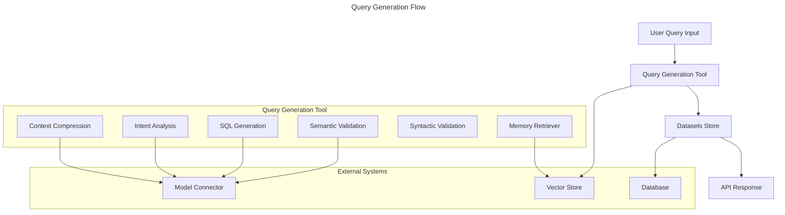

# LLM Chat Component

A Loopack4 based component to integrate a basic Langgraph.js based endpoint in your application which can use any tool that you register using the provided decorator.

### Installation

Install AIIntegrationsComponent using `npm`;

```sh
$ [npm install | yarn add] @arc/llm-chat-component
```

### Basic Usage

Configure and load the AIIntegrations component in the application constructor
as shown below.

```ts
import {AiIntegrationsComponent} from '@arc/llm-chat-component';
// ...
export class MyApplication extends BootMixin(
  ServiceMixin(RepositoryMixin(RestApplication)),
) {
  constructor(options: ApplicationConfig = {}) {
    // could be any LLM provider or your own LangGraph supported LLM provider
    // you can also have different LLM for different LLM type - cheap, smart and multimodal
    this.bind(AiIntegrationBindings.CheapLLM).toProvider(Ollama);
    this.bind(AiIntegrationBindings.SmartLLM).toProvider(Ollama);
    this.bind(AiIntegrationBindings.FileLLM).toProvider(Ollama);
    // configuration
    this.bind(AiIntegrationBindings.Config).to({
      // if not set to true, it will bind a ARC based sequence from @sourceloop/core with authentication and authorization
      useCustomSequence: true,
      // if not set to false, it will bind the core component from @sourceloop/core by default
      mountCore: false
      // if not set to false, it will bind @sourceloop/file-utils component with defaults config
      mountFileUtils: false
    });
    this.component(AiIntegrationsComponent);

    // ...
  }
  // ...
}
```

## LLM Providers

### Ollama

To need the `Ollama` based models, install the package - `@langchain/ollama` and update your application.ts -

```ts
this.bind(AiIntegrationBindings.CheapLLM).toProvider(Ollama);
this.bind(AiIntegrationBindings.SmartLLM).toProvider(Ollama);
this.bind(AiIntegrationBindings.FileLLM).toProvider(Ollama);
```

### Gemini

To use the `Gemini` based models, install the package - `@google/generative-ai` and `@langchain/google-genai` and update your application.ts -

```ts
this.bind(AiIntegrationBindings.CheapLLM).toProvider(Gemini);
this.bind(AiIntegrationBindings.SmartLLM).toProvider(Gemini);
this.bind(AiIntegrationBindings.FileLLM).toProvider(Gemini);
```

### Cerebras

To use the `Cerebras` based models, install the package - `@langchain/cerebras` and update your application.ts -

```ts
this.bind(AiIntegrationBindings.CheapLLM).toProvider(Cerebras);
this.bind(AiIntegrationBindings.SmartLLM).toProvider(Cerebras);
this.bind(AiIntegrationBindings.FileLLM).toProvider(Cerebras);
```

### Anthropic

To use the `Anthropic` based models, install the package - `@langchain/anthropic` and update your application.ts -

```ts
this.bind(AiIntegrationBindings.CheapLLM).toProvider(Anthropic);
this.bind(AiIntegrationBindings.SmartLLM).toProvider(Anthropic);
this.bind(AiIntegrationBindings.FileLLM).toProvider(Anthropic);
```

### Bedrock

To use the `Bedrock` based models, install the package - `@langchain/aws` and update your application.ts -

```ts
this.bind(AiIntegrationBindings.CheapLLM).toProvider(Bedrock);
this.bind(AiIntegrationBindings.SmartLLM).toProvider(Bedrock);
this.bind(AiIntegrationBindings.FileLLM).toProvider(Bedrock);
```

This binding would add an endpoint `/generate` in your service, that can answer user's query using the registered tools. By default, the module gives one set of tools through the `DbQueryComponent`

## DbQueryComponent

This component provides a set of pre-build tools that can be plugged into any Loopback4 application -

- generate-query - this tool can be used by the LLM to generate a database query based on user's prompt. It will return a `DataSet` instead of the query directly to the LLM.
- improve-query - this tool takes a `DataSet`'s id and a feedback or suggestion from the user, and uses it to modify the existing `DataSet` query.
- ask-about-dataset - this tools takes a `DataSet`'s id and a user prompt, and tries to answer user's question about the database query. Note that it can not run the query.

### Query Generation Flow



## Usage

You just need to register your models in the configuration of the component, and if the Models have proper and detailed descriptions, the tools should be able to answer the user's prompts based on those descriptions.

```ts
this.bind(DbQueryAIExtensionBindings.Config).to({
  models: [
    {
      model: Employee, // A normal loopback4 model class with proper description
      readPermissionKey: '1', // permission key used to check access for this particular model/table
    },
  ],
  db: {
    dialect: SupportedDBs.PostgreSQL, // dialect for which the SQL will be generated.
    schema: 'public', // schema of the database in case of DBs like Postgresql
  },
});
this.component(DbQueryComponent);
```

You also need to create a loopback4 datasource with the name - `db`, but if you have an existing datasource that you want to use, you can provide it's name like this -

```ts
this.bind(DatasetServiceBindings.Config).to({
  datasourceName: 'datasetdb',
});
```

## Writing Your Own Tool

You can register your own tools by simply using the `@graphTool()` decorator and implementing the `IGraphTool` interface. Any such class would be automatically registered with the `/generate` endpoint and the LLM would be able to use it as a tool.

```ts
import {tool} from '@langchain/core/tools';
import z from 'zod';
import {graphTool, IGraphTool} from '@arc/llm-chat-component';

...
@graphTool()
export class AddTool implements IGraphTool {
  needsReview = false;

  build() {
    return tool((ob: {a: number, b: number}) => {
        return ob.a + ob.b
    },
    {
        name: 'add-tool',
        description: 'a tool to add two numbers',
        schema: z.object({
            a: z.number(),
            b: z.number()
        })
    });
  }
}
```
